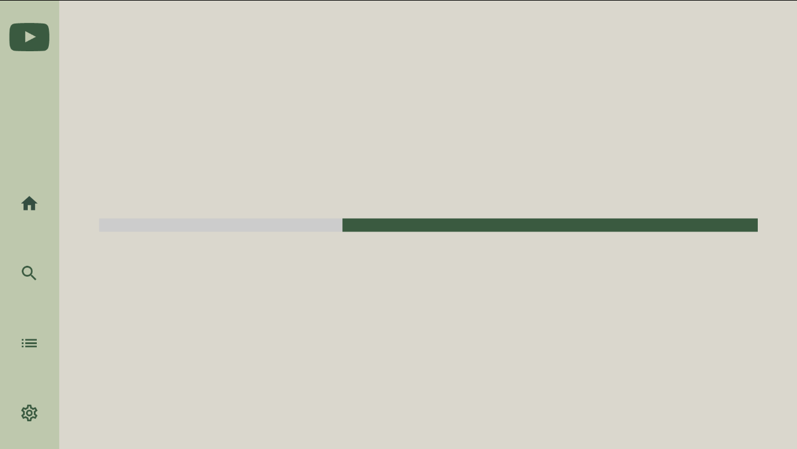

# 
 Youtube 

## 
TV - oriented Clone of Youtube with their API 

## 🧪 60 - 30 - 10 design

<table border="1">
<thead>
  <tr>
    <th>Light mode</th>
    <th>Dark mode</th>
  </tr>
</thead>
<tbody>
  <tr>
    <td></td>
    <td></td>
  </tr>
  <tr>
    <td></td>
    <td></td>
  </tr>
<tr>
    <td></td>
    <td></td>
</tr>
</tbody>
</table>

## 🪚 Status

    App has basic functions like trending video browsing and playing videos but there is one issue.
    Youtube API doesnt support any views only iframe which is not so much supported by Android TV.
    I can like open video and play it but not so much add my own features like comment or like.
    That cuts many of future features that I would implement.
    Only few external like share and title with redirrection to Youtube App.
    I have decided to cut external app opening but I wont  be able to remove Share button.

    Soon App will have Search Option with history saving.

[Iframe issue](https://stackoverflow.com/questions/9640265/problems-giving-focus-to-an-iframe-on-smart-tv)
I was regarding to

## 🎯​ Test Coverage ████████░░ 80%

    Most important files are covered currently (1.0.1 status)

## 📱 How to run

1. Install Android Studio according
   to [tutorial](https://developer.android.com/studio?gclid=CjwKCAjwnOipBhBQEiwACyGLukOqCPF7rjbRbw2zo-hldBEOSCVk0P0B1bFUCJjxdKyi6zGc3daUzhoCwSkQAvD_BwE&gclsrc=aw.ds)
2. Download necessary SDK tools
3. Configure Android emulator or connect external device
4. Clone repository from button '<> Code'
5. Click Run button : )

## ⚙️ Config

Config files based on Kotlin DSL.  
Dependencies in TOML file

## 🤔​ Planning

Jira
at [Youtube Jira](https://mobile-pablo.atlassian.net/jira/software/c/projects/YTV/boards/5)  
Qase at [Youtube Qase](https://app.qase.io/project/YTC)  

## 🛠️​ Tech stack

  

## 📸 Screenshots

<h3><b>CI/CD</b></h3>
<table>
<tbody>
  <tr>
    <th><b>CI</b> <i>(primary)</i></th>
    <th></th>
  </tr>
  <tr>
    <th><b>CD</b> <i>(staging)</i></th>
    <td> </td>
  </tr>
  <tr>
    <th><b>CD</b> <i>(deploy)</i></th>
    <td>
  
</td>
  </tr>
</tbody>
</table>

  

<h3><b>Config</b></h3>
<table>
<tbody>
  <tr>
    <th>Firebase App Distribution</th>
    <th></th>
  </tr>
  <tr>
    <th>Jira</th>
    <td></td>
  </tr>
  <tr>
    <th>Crashlytics</th>
    <td></td>
  </tr>
  <tr>
    <th>Qase (to be improved</th>
    <td></td>
  </tr>
</tbody>
</table>

## 🙊​ Google Play - Status

    App new releases only will be internal for Youtube Privacy Law.
    Non less it still uses CD - Deploy workflow only not for production

## ​🔗​ To be added (1.0.1)

    * Add Kover plugin

## 🫧​ Design

I implemented and used 60 - 30 - 10 rule for this design
  

  

Implementation based
on [Youtube TV Design](https://dribbble.com/shots/4552223-YouTube-TV-App-Redsign)
